# **Аналитические артефакты и описание проекта**

---

## **1. Основные объекты продукта** ✈️

| **Объект**                     | **Атрибуты**                                                                 | **Операции**                                                                                     | **Связи**                                                                                       |
|--------------------------------|-----------------------------------------------------------------------------|--------------------------------------------------------------------------------------------------|-------------------------------------------------------------------------------------------------|
| **Багаж**                      | - Вес - Размеры (длина, ширина, высота) - Хрупкость (в диапазоне [0;1]) | - Взвешивание - Оценка размеров - Получение рентгеновского снимка                          | - Взвешивается и замеряется сотрудниками - Анализируется моделью компьютерного зрения - Передаётся в алгоритм укладки |
| **Багажный отсек**             | - Максимальная грузоподъёмность - Размеры (форма отсека, ограничения по размерам) | - Получение данных о доступном объёме и весе - Применение схемы укладки                       | - Целевой объект для оптимизации - Взаимодействует с алгоритмом укладки                     |
| **Алгоритм укладки багажа**    | - Критерии оптимизации (вес, объём, хрупкость) - Ограничения (максимальный вес, объём) | - Учёт текущего состояния багажного отсека - Обработка входных данных о багаже - Выработка итогового решения | - Получает данные о багаже и отсеке - Передаёт схему укладки в интерфейс                    |
| **Модель компьютерного зрения**| - Точность классификации - Тип и структура модели                         | - Анализ рентгеновских снимков - Классификация багажа по степени хрупкости                    | - Взаимодействует с багажом - Передаёт данные в алгоритм укладки                            |
| **Интерфейс для сотрудников**  | - Входные данные багажа - Визуализация схемы укладки                      | - Ввод данных о багаже - Отображение оптимальной схемы укладки                                | - Принимает команды от сотрудников - Получает данные от алгоритма - Передаёт данные сотрудникам |
| **Сотрудник аэропорта**        | - Должность - Уровень доступа к интерфейсу                                | - Замер веса и размеров багажа - Ввод данных в интерфейс - Реализация схемы укладки        | - Взаимодействует с интерфейсом - Передаёт данные о багаже в систему                         |

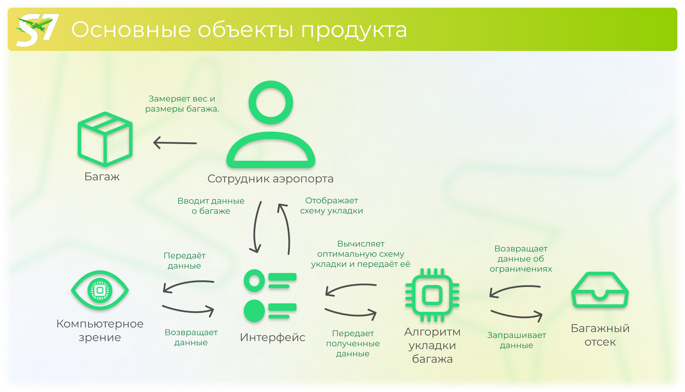

---

## **2. Ролевая модель** ✈️

В системе, предлагаемой для оптимизации укладки багажа, ключевыми пользователями являются сотрудники аэропортов и авиакомпаний, а также администраторы системы. Каждый из них выполняет определённые функции, которые обеспечивают эффективную работу системы. Рассмотрим роли и их особенности:

### Работа системы строится по следующим основным принципам:
  - Каждый пользователь регистрируется в системе с указанием своей роли (например, оператор, администратор, супервайзер).
  - Роль определяет уровень доступа к функциям системы.
  - Администратор системы назначает роли на основе должностных обязанностей сотрудников.
  - Роли могут быть изменены или удалены только администратором.

| **Роль**                     | **Функции**                                                                 | **Ограничения**                                                                 | **Назначение роли**                                                                 |
|-------------------------------|-----------------------------------------------------------------------------|--------------------------------------------------------------------------------|------------------------------------------------------------------------------------|
| **Сотрудник аэропорта**       | - Замер веса и размеров багажа. - Ввод данных о багаже в систему. - Получение и реализация схемы укладки. | - Доступ только к функциям, связанным с вводом данных и получением инструкций. - Не может изменять настройки системы или алгоритмы. | - Роль назначается администратором аэропорта или авиакомпании на основе должностных обязанностей. |
| **Администратор системы**     | - Настройка и конфигурация системы. - Управление пользователями. - Мониторинг работы системы и устранение неполадок. | - Не имеет доступа к операциям, связанным с укладкой багажа. - Не может изменять данные о багаже, введённые операторами. | - Роль назначается руководством аэропорта или авиакомпании. Обычно это системный администратор. |
| **Сотрудник авиакомпании**    | - Контроль за процессом укладки багажа. - Анализ отчётов о работе системы. - Внесение предложений по улучшению работы системы. | - Не имеет доступа к настройкам системы. - Может только просматривать данные и отчёты, но не изменять их. | - Роль назначается руководством авиакомпании. Обычно это сотрудник, ответственный за логистику или обслуживание багажа. |
| **Системный аналитик**        | - Анализ данных, генерируемых системой. - Подготовка отчётов и рекомендаций для руководства. | - Доступ только к данным и отчётам, без возможности изменять настройки системы. | - Роль назначается руководством аэропорта или авиакомпании. Обычно это сотрудник, ответственный за аналитику и оптимизацию процессов. |
| **Грузовой оператор**         | - Ввод данных о грузах (вес, размеры, хрупкость). - Получение и реализация схемы укладки грузов. | - Доступ только к функциям, связанным с грузами. - Не может изменять настройки системы или алгоритмы. | - Роль назначается администратором логистической компании. |

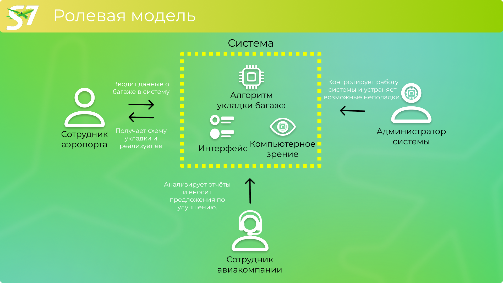

---

## **3. Пользовательские/Функциональные/Нефункциональные требования** ✈️

Для успешной реализации решения по оптимизации укладки багажа необходимо определить и классифицировать требования. Они делятся на три категории: **пользовательские**, **функциональные** и **нефункциональные**. Рассмотрим каждую из них.

### 1. **Пользовательские требования**
Пользовательские требования описывают, что система должна делать с точки зрения конечного пользователя. Далее они будут представлены в виде **диаграммы вариантов использования (Use Case Diagram)**, которая визуализирует взаимодействие пользователей с системой.

**Можно выделить следующие основные пользовательские требования**:
- Система должна предоставлять интерфейс для ввода данных о багаже (вес, размеры, хрупкость).
- Система должна анализировать рентгеновские снимки багажа для определения хрупкости.
- Система должна генерировать оптимальную схему укладки багажа в багажный отсек.
- Система должна отображать схему укладки в удобном для сотрудников формате.
- Система должна предоставлять отчёты о работе (эффективность укладки, повреждения багажа, расход топлива).

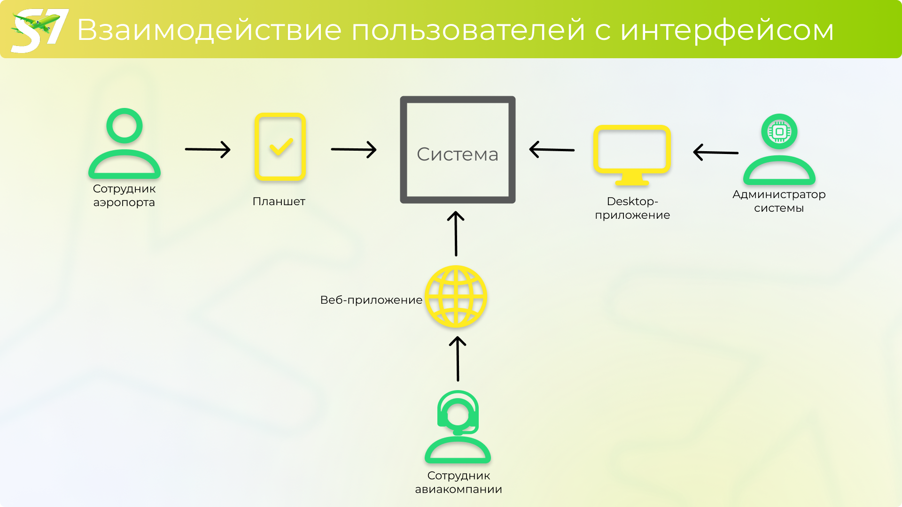

### 2. **Функциональные требования**
Функциональные требования описывают, какие функции должна выполнять система.

**Определим функциональные требования системы**:
- Система должна поддерживать ввод данных о багаже (вес, размеры, хрупкость).
- Система должна интегрироваться с рентгеновскими сканерами для анализа хрупкости багажа.
- Система должна использовать генетический алгоритм для оптимизации укладки багажа.
- Система должна учитывать ограничения багажного отсека (максимальный вес, объём).
- Система должна предоставлять API для интеграции с существующими системами аэропортов и авиакомпаний.
- Система должна генерировать отчёты о работе в реальном времени.

### 3. **Нефункциональные требования**
Нефункциональные требования описывают, как система должна работать, включая производительность, безопасность и другие аспекты. Стоит отметить, что все пороговые значения, представленные ниже, могут быть пересмотрены при дальнейшей реализации системы и её интеграции в существующие системы аэропортов и авиакомпаний.

**К общим (нефункциональным) требованиям можно отнести следующие критерии**:
- **Производительность**:
  - Система должна обрабатывать данные о багаже и генерировать схему укладки за время, не превышающее порговое 5 секунд.
  - Система должна поддерживать обработку до 1000 единиц багажа в час.
- **Надёжность**:
  - Система должна иметь время безотказной работы не менее 99,999%.
  - Система должна автоматически восстанавливаться после сбоев.
- **Безопасность**:
  - Система должна обеспечивать защиту данных о багаже и пользователях.
  - Доступ к системе должен быть ограничен на основе ролей.
- **Масштабируемость**:
  - Система должна поддерживать увеличение нагрузки (например, в пиковые часы работы аэропорта).
- **Удобство использования**:
  - Интерфейс системы должен быть интуитивно понятным для сотрудников аэропорта.
  - Система должна поддерживать многоязычный интерфейс.

---

## **4. Прототипы интерфейса** ✈️

Наше решение включает **Desktop-приложение** и **веб-приложение**, которые предназначены для использования сотрудниками аэропортов, авиакомпаний и логистических компаний. Основной акцент сделан на удобство работы через **планшеты** или аналогичные устройства, так как это позволяет сотрудникам быстро вводить данные и получать инструкции в зоне обработки багажа. Интерфейс системы разработан для упрощения процесса укладки багажа и предоставления визуализации оптимальной схемы. Рассмотрим возможности интерфейса, экранные формы и взаимодействие пользователей с системой.

### 1. Основные экранные формы

| **Форма**                     | **Описание**                                                                 | **Элементы интерфейса**                                                                 |
|-------------------------------|-----------------------------------------------------------------------------|----------------------------------------------------------------------------------------|
| **Форма ввода параметров багажа** | - Экранная форма для ввода данных о багаже: длина, ширина, высота, вес, хрупкость. - Возможность сканирования штрих-кода или QR-кода. | - Поля для ввода текста (длина, ширина, высота, вес). - Ползунок или выпадающий список для выбора уровня хрупкости. - Кнопка "Добавить сумку". |
| **Форма ввода параметров отсека** | - Экранная форма для ввода данных о багажном отсеке: длина, ширина, высота, грузоподъёмность. | - Поля для ввода текста (длина, ширина, высота, грузоподъёмность). - Кнопка "Установить отсек". |
| **Форма визуализации укладки** | - Визуализация оптимальной схемы укладки багажа в багажный отсек. - Возможность масштабирования и поворота схемы. | - 3D-модель багажного отсека с размещённым багажом. - Кнопка "Перестроить приоритет". |
| **Форма управления процессом** | - Экранная форма для управления процессом укладки: добавление новых сумок, изменение приоритетов, подтверждение укладки. | - Кнопка "Добавить сумку". - Кнопка "Перестроить приоритет". - Кнопка "Подтвердить укладку". |

### 2. **Взаимодействие пользователей с интерфейсом**

| **Роль**                     | **Основные действия**                                                                 | **Устройства**                                                                 |
|-------------------------------|-------------------------------------------------------------------------------------|-------------------------------------------------------------------------------|
| **Сотрудник аэропорта (Оператор багажа)** | - Ввод параметров багажа через форму ввода. - Ввод параметров отсека. - Получение и визуализация схемы укладки. - Подтверждение укладки багажа. | Планшет для удобства работы в зоне обработки багажа.                           |
| **Администратор системы**     | - Настройка параметров системы через форму ввода параметров отсека. - Управление пользователями и их ролями. | Desktop-приложение для работы в офисе.                                         |
| **Сотрудник авиакомпании (Супервайзер)** | - Просмотр аналитических отчётов через форму визуализации. - Внесение предложений по улучшению работы системы. | Веб-приложение для доступа из любого места.    

### 3. **Пример интерфейса**
Изначально интерфейс был спроектирован примерно в следующем формате:

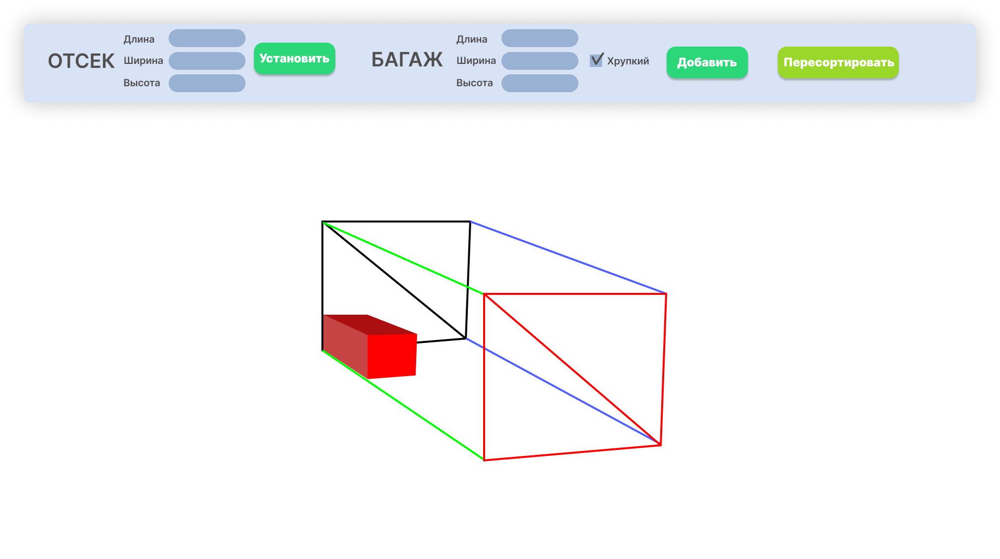

Однако, в ходе работы систему получилось реализовать, и сейчас desktop-приложение выглядит следующим образом:

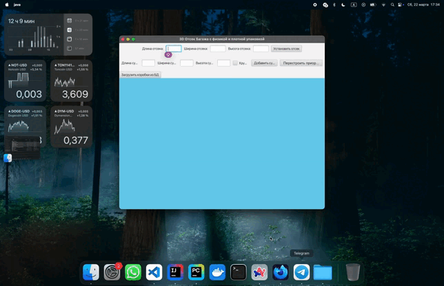

При этом, web-приложение имеет следующий интерфейс:

---

## **5. Перспективы расширения системы** ✈️

| **Возможное направление**               | **Описание**                                                                                                                                 | **Цель**                                                                                   |
|------------------------------------------|---------------------------------------------------------------------------------------------------------------------------------------------|----------------------------------------------------------------------------------------------------|
| **Интеграция с системами управления багажом** | Интеграция с системами, такими как **SITA Bag Manager**, для автоматического обмена данными о багаже.                                       | Упрощение процессов для сотрудников, повышение точности данных.                                    |
| **Использование ИИ для прогнозирования** | Внедрение ИИ для прогнозирования загрузки багажных отсеков на основе исторических данных и текущих тенденций.                               | Улучшение планирования, снижение рисков перегрузки.                                                |
| **Расширение на другие виды транспорта** | Адаптация системы для использования в железнодорожных перевозках, морских контейнерах или грузовых автомобилях.                             | Расширение рынка сбыта, универсальность решения.                                                   |
| **Мобильное приложение для сотрудников** | Разработка мобильного приложения для ввода данных о багаже и получения схем укладки на смартфоны или планшеты.                              | Удобство и мобильность для сотрудников, повышение скорости обработки багажа.                       |
| **Интеграция с системами управления ресурсами аэропорта** | Интеграция с системами, такими как **SITA Airport Operations**, для автоматического учёта данных о рейсах и самолётах.                     | Повышение гибкости системы, снижение нагрузки на персонал.                                         |
| **Дополнительные аналитические функции** | Добавление функций для анализа данных о повреждениях багажа, времени обработки и эффективности укладки.                                     | Улучшение качества обслуживания, снижение затрат на компенсации.                                   |
| **Интеграция с IoT-устройствами**        | Использование IoT-устройств (датчиков веса и объёма) для автоматического сбора данных о багаже.                                             | Ускорение процессов обработки, повышение точности данных.                                          |
| **Поддержка блокчейн-технологий**        | Использование блокчейна для отслеживания багажа на всех этапах перевозки.                                                                   | Повышение прозрачности и безопасности, снижение риска потери багажа.                               |
| **Расширение на международные рынки**    | Адаптация системы для работы в различных странах с учётом местных стандартов и требований. Добавление поддержки multiple languages.         | Расширение географии использования, увеличение потенциальной аудитории.                            |
| **Интеграция с системами бронирования и регистрации** | Интеграция с системами бронирования и регистрации пассажиров для автоматического учёта данных о багаже на этапе регистрации.               | Ускорение процессов регистрации и обработки багажа, повышение удобства для пассажиров.             |

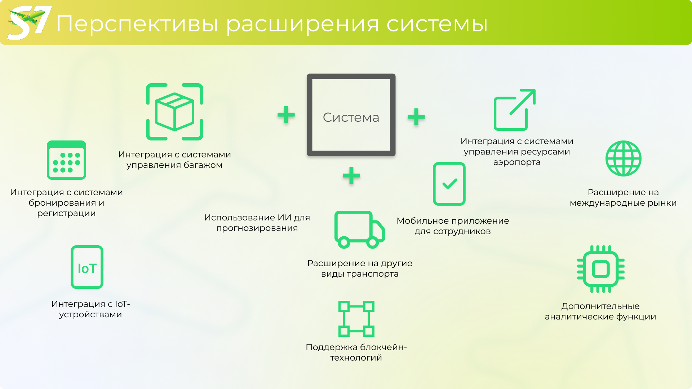

---

## **6. Анализ рынка** ✈️

Прежде чем было принято решение исследовать тендеции по утерянному багажу. Диаграмма, отражающая их, представлена ниже:

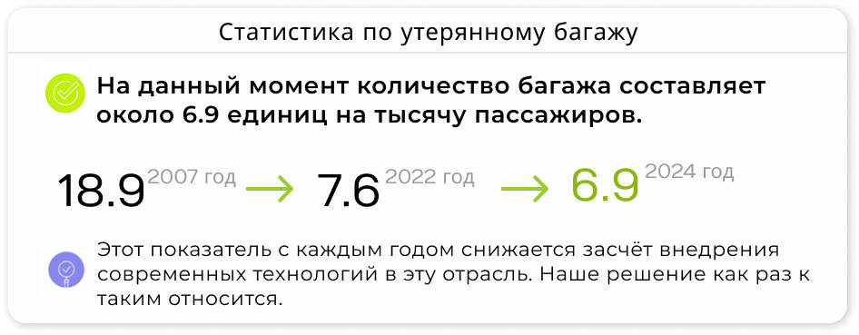

Имеет смысл выделить три основных причины проблем с багажом: потеря, повреждение и задержка. Их составляющие отражены на следующей диаграмме: 

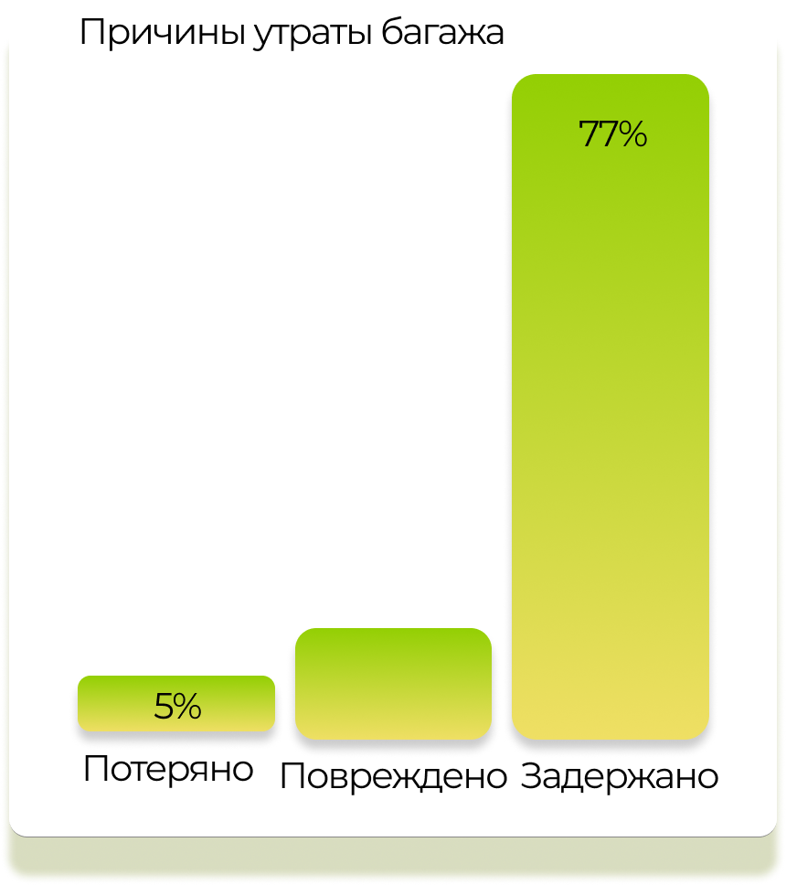

Интересно не только количество утерянного багажа на тысячу пассажиров, но и их абсолютное количество, определяемое количеством самих пассажиров. На диаграмме ниже видна общемировая тенденция увеличения числа пассажиров:

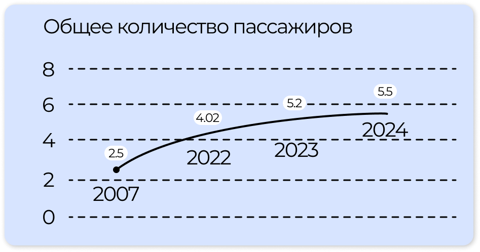

В более общем формате данные представлены следующим образом:

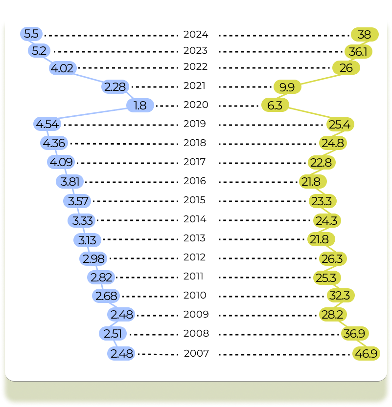

Имеет смысл более детально рассмотреть статистику по регионам. Рассмотрим диаграмму ниже:

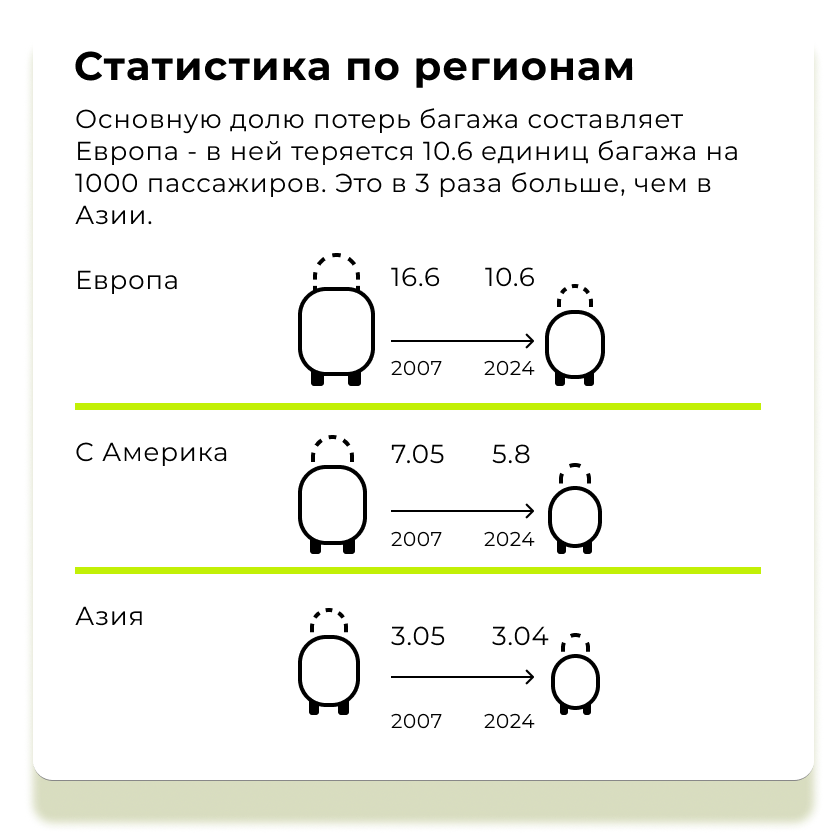

Заметим, что страны Азии лучше других минимизировали количество утерянного багажа на 1000 человек. Это связано прежде всего с тем, что они внедряют современные решения на базе искусственного интеллекта. Наше решение как раз относится к таким. Таким образом, имеет смысл перенять опыт и внедрить предлагаемую нами систему в работу.

---